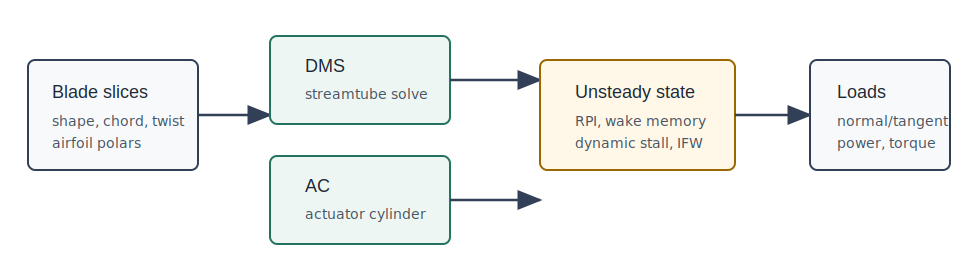

# OWENSAero.jl

OWENSAero provides the aerodynamic models used by OWENS for vertical-axis wind and water turbines. It can also be used directly for single-slice studies, full stacked-slice turbine calculations, and OpenFAST InflowWind-driven turbulent inflow cases.

The package contains two primary VAWT aerodynamic paths:

| Path | Main use | Notes |
| --- | --- | --- |
| Double-multiple-streamtube (DMS) | Fast design sweeps, optimization, and regression testing | Implemented in `DMS` and selected by `Environment(..., AeroModel = "DMS", ...)`. |
| Actuator cylinder (AC) | Higher-fidelity steady slice loading and multi-turbine influence work | Implemented in `AC` and selected by `AeroModel = "AC"`. |

Both paths share the `Turbine`, `Environment`, and `UnsteadyParams` data structures. The high-level turbine workflow in `setupTurb`, `steadyTurb`, and `advanceTurb` builds one or more vertical slices, stores model state, and returns distributed aerodynamic loads for coupling to OWENS structural dynamics.

## Documentation Map

- [Quickstart](quickstart.md) shows the smallest direct slice and full-turbine calls.
- [Model Selection](model_selection.md) explains when to use DMS, AC, dynamic stall, RPI, and InflowWind.
- [Full Turbine Workflow](full_turbine_workflow.md) documents the stateful `setupTurb`/`steadyTurb`/`advanceTurb` path used by coupled OWENS runs.
- [Dynamic Stall](dynamic_stall.md) documents the Boeing-Vertol test/example path.
- [RM2 Example](rm2_example.md) points to the standalone RM2 aerodynamic example.
- [Frames, Units, and Outputs](theory/frames_units.md) records load directions and expected SI units.
- [Validation and Testing](validation.md) identifies the tests that currently pin model behavior and the remaining validation gaps.
- [API Reference](reference/reference.md) is the generated function and type index.
